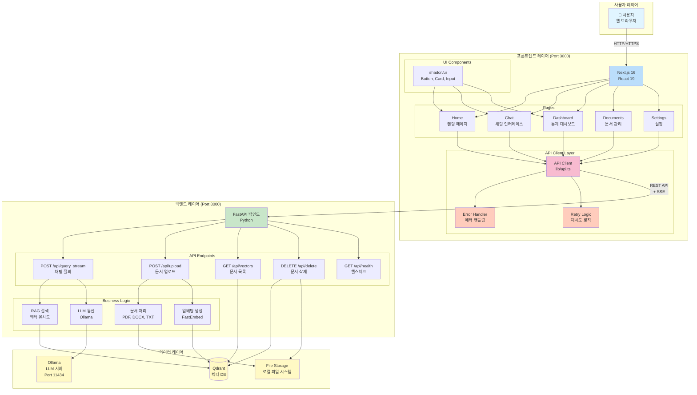
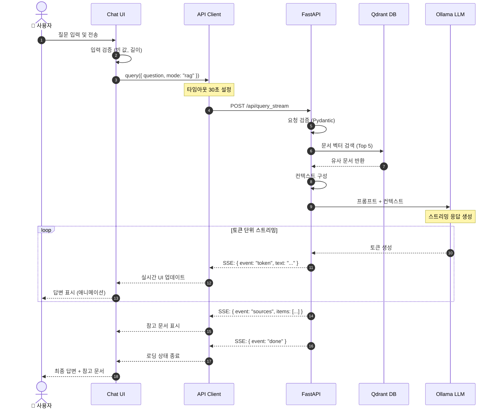
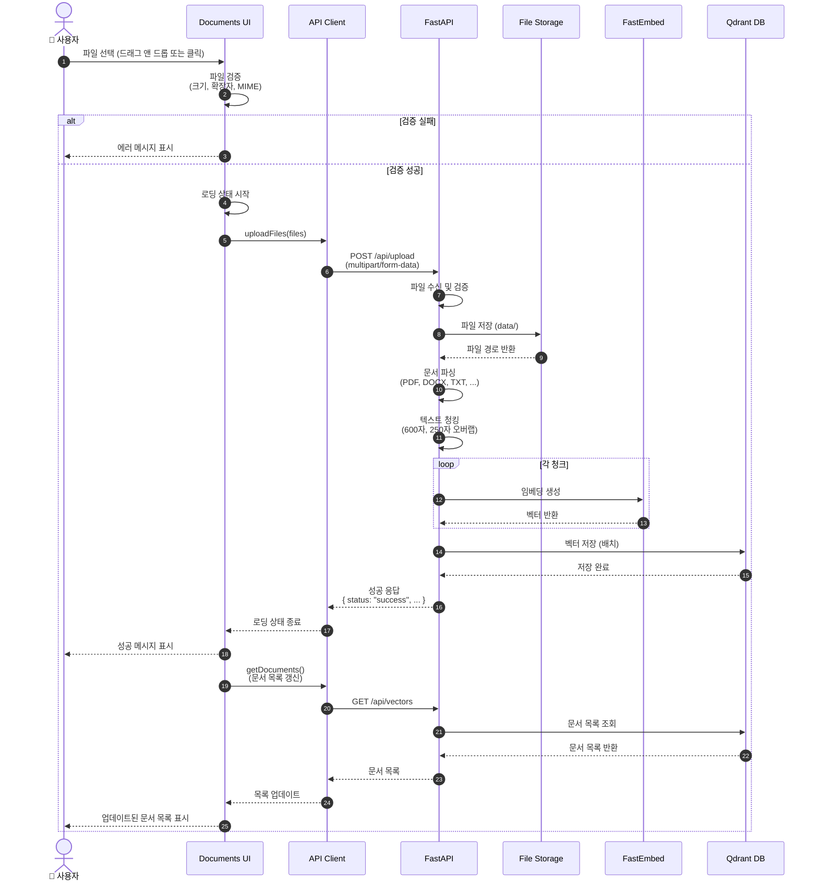
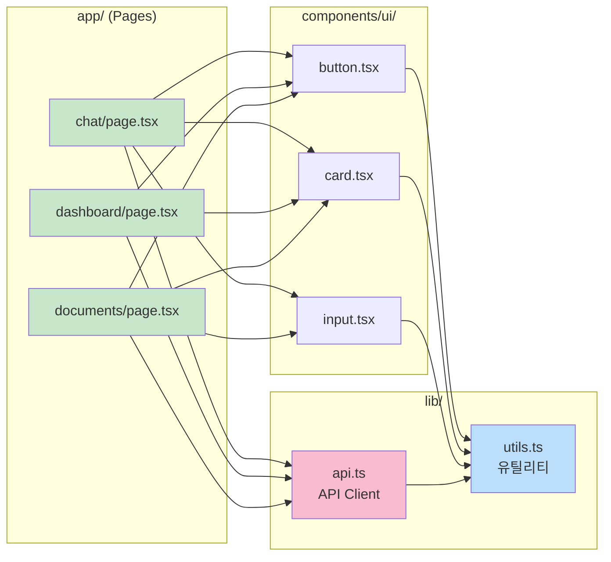
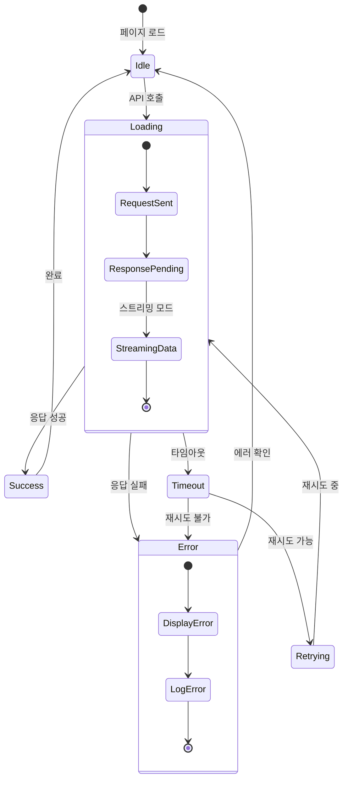
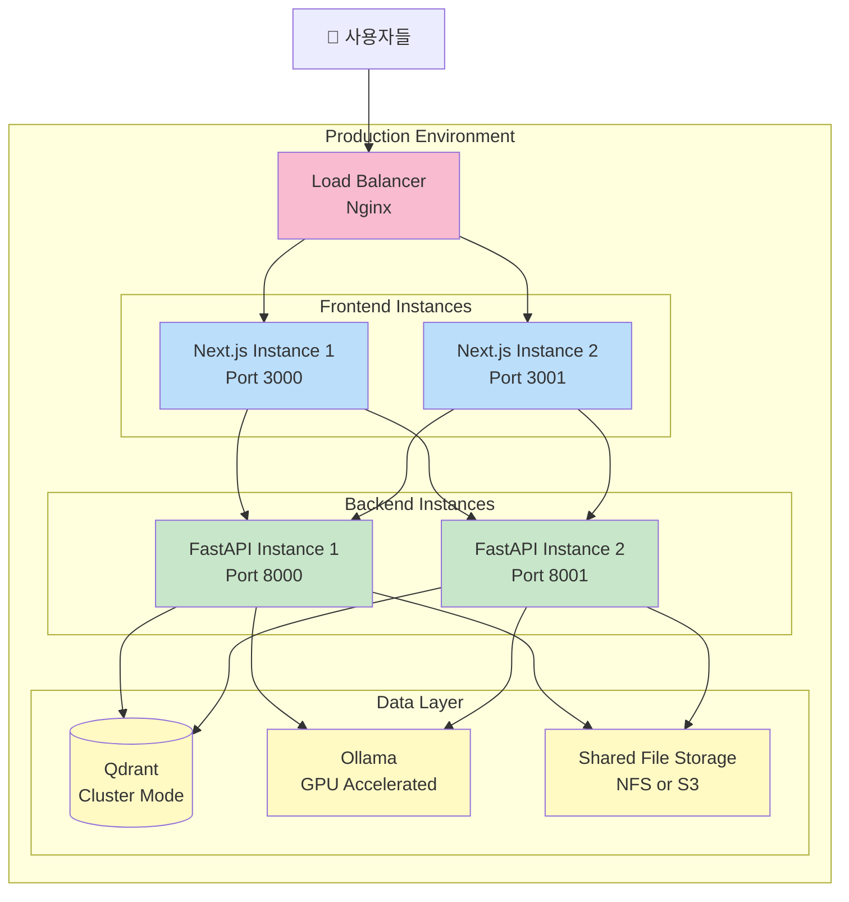
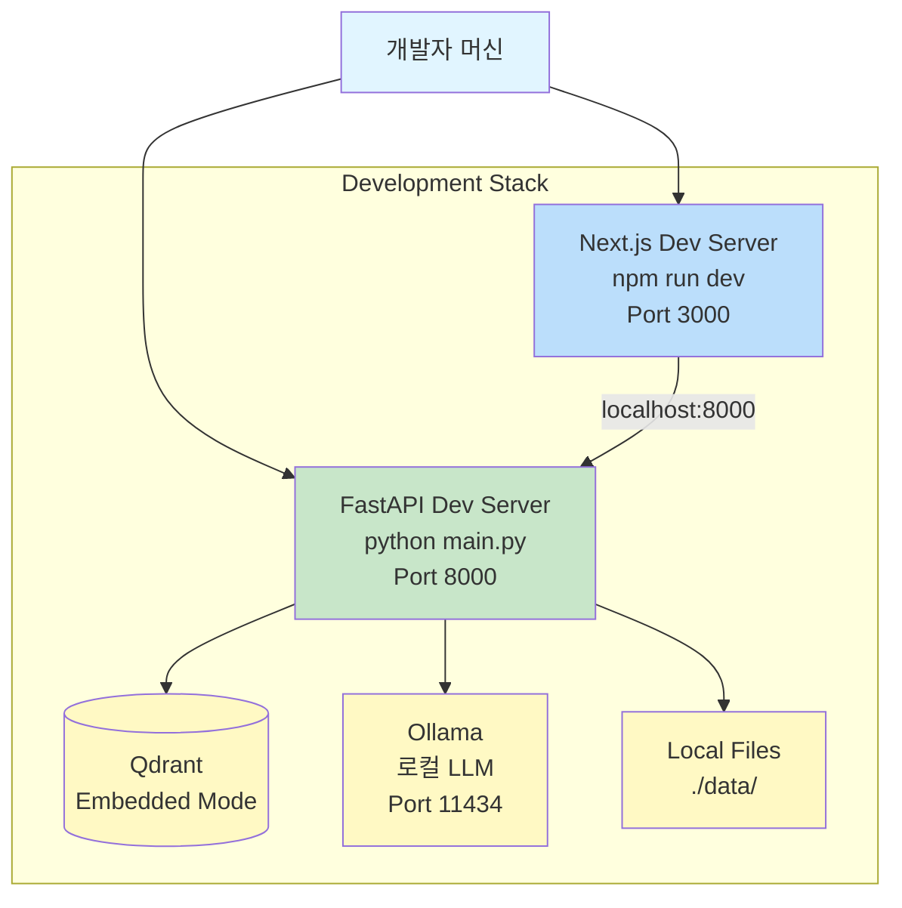

# DocuNova 아키텍처 다이어그램

## 📋 문서 개요

이 문서는 Mermaid 다이어그램을 사용하여 DocuNova SaaS의 전체 아키텍처를 시각화합니다.

---

## 1. 전체 시스템 아키텍처



---

## 2. 채팅 질의 플로우 (RAG 모드)



---

## 3. 문서 업로드 플로우



---

## 4. 에러 핸들링 플로우

```mermaid
flowchart TD
    START([API 호출 시작])

    TRY[Try: API 요청 실행]
    SUCCESS{성공?}

    TIMEOUT{타임아웃?}
    RETRY_CHECK{재시도<br/>횟수 < 3?}
    WAIT[1초 대기]
    RETRY[재시도]

    NETWORK{네트워크<br/>에러?}
    SERVER{서버<br/>에러 5xx?}
    CLIENT{클라이언트<br/>에러 4xx?}

    HANDLE_TIMEOUT[타임아웃 에러 처리<br/>"요청 시간 초과"]
    HANDLE_NETWORK[네트워크 에러 처리<br/>"연결 실패"]
    HANDLE_SERVER[서버 에러 처리<br/>"서버 오류"]
    HANDLE_CLIENT[클라이언트 에러 처리<br/>"잘못된 요청"]
    HANDLE_UNKNOWN[알 수 없는 에러 처리<br/>"오류 발생"]

    SHOW_ERROR[사용자에게<br/>에러 메시지 표시]
    LOG[에러 로그 기록]
    END([종료])

    START --> TRY
    TRY --> SUCCESS

    SUCCESS -->|Yes| END
    SUCCESS -->|No| TIMEOUT

    TIMEOUT -->|Yes| RETRY_CHECK
    RETRY_CHECK -->|Yes| WAIT
    WAIT --> RETRY
    RETRY --> TRY
    RETRY_CHECK -->|No| HANDLE_TIMEOUT

    TIMEOUT -->|No| NETWORK
    NETWORK -->|Yes| HANDLE_NETWORK
    NETWORK -->|No| SERVER
    SERVER -->|Yes| HANDLE_SERVER
    SERVER -->|No| CLIENT
    CLIENT -->|Yes| HANDLE_CLIENT
    CLIENT -->|No| HANDLE_UNKNOWN

    HANDLE_TIMEOUT --> SHOW_ERROR
    HANDLE_NETWORK --> SHOW_ERROR
    HANDLE_SERVER --> SHOW_ERROR
    HANDLE_CLIENT --> SHOW_ERROR
    HANDLE_UNKNOWN --> SHOW_ERROR

    SHOW_ERROR --> LOG
    LOG --> END

    style START fill:#c8e6c9
    style END fill:#c8e6c9
    style SUCCESS fill:#fff9c4
    style TIMEOUT fill:#fff9c4
    style NETWORK fill:#fff9c4
    style SERVER fill:#fff9c4
    style CLIENT fill:#fff9c4
    style RETRY_CHECK fill:#fff9c4
    style SHOW_ERROR fill:#ffccbc
    style HANDLE_TIMEOUT fill:#ffccbc
    style HANDLE_NETWORK fill:#ffccbc
    style HANDLE_SERVER fill:#ffccbc
    style HANDLE_CLIENT fill:#ffccbc
    style HANDLE_UNKNOWN fill:#ffccbc
```

---

## 5. 컴포넌트 의존성 다이어그램



---

## 6. 상태 관리 다이어그램



---

## 7. 백엔드 모듈 구조

```mermaid
graph TB
    MAIN[main.py<br/>FastAPI 앱]

    subgraph "API Endpoints"
        EP1[/api/query_stream]
        EP2[/api/upload]
        EP3[/api/vectors]
        EP4[/api/delete]
        EP5[/api/health]
    end

    subgraph "Business Logic"
        DOC[Document Processor<br/>문서 파싱]
        CHUNK[Text Chunker<br/>텍스트 청킹]
        EMB[Embedding Generator<br/>임베딩 생성]
        SEARCH[Vector Search<br/>유사도 검색]
        LLMCLIENT[LLM Client<br/>Ollama 통신]
    end

    subgraph "Data Access"
        QDRANT_CLIENT[Qdrant Client<br/>벡터 DB 접근]
        FILE_STORAGE[File Storage<br/>파일 시스템]
    end

    subgraph "Utilities"
        LOGGER[Logger<br/>로깅]
        CONFIG[Config<br/>환경 변수]
        VALIDATOR[Validator<br/>입력 검증]
    end

    MAIN --> EP1
    MAIN --> EP2
    MAIN --> EP3
    MAIN --> EP4
    MAIN --> EP5

    EP1 --> SEARCH
    EP1 --> LLMCLIENT
    EP2 --> DOC
    EP2 --> CHUNK
    EP2 --> EMB
    EP3 --> QDRANT_CLIENT
    EP4 --> QDRANT_CLIENT
    EP4 --> FILE_STORAGE

    DOC --> FILE_STORAGE
    EMB --> QDRANT_CLIENT
    SEARCH --> QDRANT_CLIENT

    MAIN --> LOGGER
    MAIN --> CONFIG
    EP1 --> VALIDATOR
    EP2 --> VALIDATOR

    style MAIN fill:#c8e6c9
    style LOGGER fill:#fff9c4
    style CONFIG fill:#fff9c4
    style VALIDATOR fill:#fff9c4
```

---

## 8. 배포 아키텍처



---

## 9. 개발 환경 아키텍처



---

## 📝 다이어그램 사용 가이드

### Mermaid 렌더링 방법

1. **GitHub/GitLab**: 자동 렌더링
2. **VS Code**: Mermaid Preview 확장 설치
3. **온라인**: https://mermaid.live/

### 다이어그램 읽는 법

- **사각형**: 컴포넌트/모듈
- **원통형**: 데이터베이스
- **화살표**: 데이터 흐름/의존성
- **점선**: 비동기/옵션
- **색상**:
  - 파란색: 프론트엔드
  - 초록색: 백엔드
  - 노란색: 데이터/인프라
  - 분홍색: 중요 레이어

---

**이 다이어그램들은 시스템의 모든 측면을 시각화합니다.** 📊
**개발 시 이 다이어그램을 참고하여 구현하세요!** ✅
